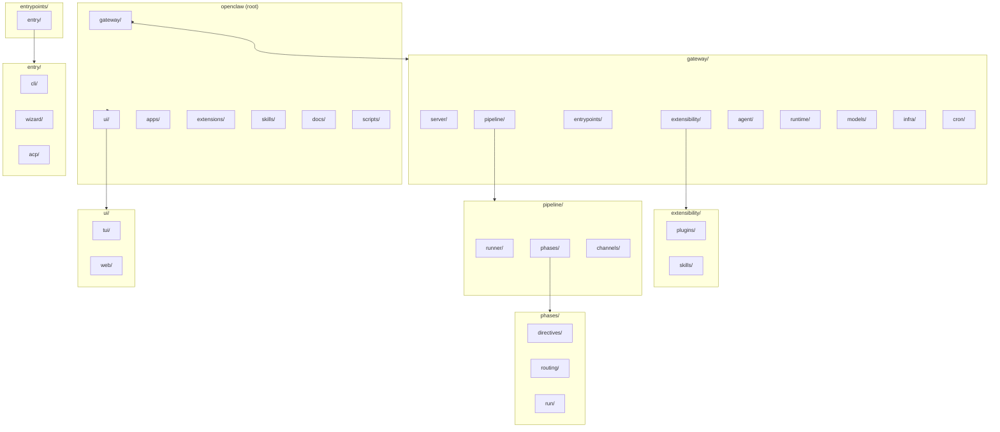

# Restructure plan: gateway + ui hierarchy

This doc proposes a **top-to-bottom hierarchical layout** with **gateway** and **ui** at the highest level. Use it to iterate on the shape; implementation will follow without breaking features.

**Status (done):** Top-level layout is in place: **gateway/** holds all former `src/` code; **ui/web/** holds the control UI (former `ui/`); **ui/tui/** holds the terminal UI (moved from `gateway/tui/`). **Infra consolidation done:** config, routing, sessions, pairing, and memory now live under **gateway/infra/** (e.g. **gateway/infra/config/**, **gateway/infra/routing/**). All imports, mocks, and UI (web + tui) have been updated. **Build and relevant tests:** `pnpm build`, `pnpm ui:build`, and gateway/infra config tests pass; path/mock-related test fixes are in place. **Server rename done:** gateway/gateway → gateway/server. **Channels and entry under entrypoints:** channels (telegram, discord, signal, slack, web, imessage, **whatsapp** helpers, etc.) and **entry** (cli, commands, wizard, acp) now live under **gateway/entrypoints/** as **gateway/entrypoints/channels/**, **gateway/entrypoints/entry/**, etc. **Runtime consolidation done:** **gateway/agents/** has been removed; all its contents (Pi embedded runner, tools, sandbox, auth-profiles, skills, workspace, etc.) now live under **gateway/runtime/** alongside link-understanding, media-understanding, and TTS. Single **gateway/agent/** holds pipeline and system prompts. Remaining: optional Phase 5 (docs under gateway/ui).

---

## 1. Top-level diagram

```
openclaw/
├── gateway/                          # All server-side and pipeline code
│   ├── server/                      # WebSocket, HTTP, RPC, session utils
│   ├── pipeline/                    # Reply lifecycle (steps and phases)
│   │   ├── runner/
│   │   ├── phases/                  # directives, routing, run
│   │   ├── channels/                # telegram, discord, signal, slack, line, web, imessage, whatsapp + shared
│   │   └── docs/
│   ├── entrypoints/                 # Channels + CLI/entry
│   │   ├── entry/                   # How users and tools get into the system
│   │   │   ├── cli/                 # Terminal CLI: openclaw <subcommand>
│   │   │   ├── commands/
│   │   │   ├── wizard/              # Onboarding / first-run setup
│   │   │   └── acp/                 # Agent Control Protocol (IDE integration)
│   │   ├── channels/                # Shared channel layer
│   │   ├── whatsapp/                # WhatsApp helpers (JID normalization, target parsing); used by web + channels
│   │   ├── telegram/, discord/, slack/, signal/, web/, imessage/, ...
│   ├── extensibility/               # Plugins (mechanism) + skills (what the agent can run)
│   │   ├── plugins/                 # Plugin runtime, hooks, plugin-sdk
│   │   └── skills/                 # In-chat command registry, skill-commands
│   ├── agent/                       # Core agent: pipeline, system prompts (reply lifecycle)
│   ├── runtime/                     # Execution + understanding: Pi runner, tools, sandbox, auth, link/media understanding, TTS
│   ├── models/                      # Remote model interfacing: providers, selection, auth
│   ├── infra/                       # Config, ports, binaries, env, errors, heartbeat, outbound, migrations
│   │   ├── config/                 # Config load/save, sessions store, schema
│   │   └── ...                     # ports, binaries, env, errors, etc.
│   ├── cron/                        # Scheduled jobs
│   └── docs/
│
├── ui/
│   ├── tui/
│   ├── web/
│   └── docs/
│
├── apps/                             # Native app build targets (see “Why at root?” below)
├── extensions/                       # Extension packages the gateway loads
├── skills/                            # User skill packages the gateway discovers
├── docs/
└── scripts/
```

---

## 2. Mermaid diagram (same structure)



---

## 3. What goes where (mapping from current layout)

| New path                                | Current location                                                                                                                         | Notes                                                                                                                                |
| --------------------------------------- | ---------------------------------------------------------------------------------------------------------------------------------------- | ------------------------------------------------------------------------------------------------------------------------------------ |
| **gateway/server/**                     | `src/gateway/`                                                                                                                           | WebSocket server, protocol, chat/usage/skills RPC, session utils, hooks, cron wiring                                                 |
| **gateway/pipeline/runner/**            | `src/auto-reply/runner.ts`, `dispatch.ts`, `reply/get-reply.ts`, `reply/dispatch-from-config.ts`                                         | Entry and dispatch                                                                                                                   |
| **gateway/pipeline/phases/directives/** | `src/auto-reply/reply/get-reply-directives*.ts`, `directive-handling*.ts`, `model-selection.ts` (reply), `mentions.ts`, `groups.ts`      | Directives phase                                                                                                                     |
| **gateway/pipeline/phases/routing/**    | `src/auto-reply/reply/phases/routing/`, `request-router.ts`                                                                              | Phase 1 + request router                                                                                                             |
| **gateway/pipeline/phases/run/**        | `src/auto-reply/reply/get-reply-run.ts`, `agent-runner*.ts`, `followup-runner.ts`, `queue/`, typing, etc.                                | Run phase                                                                                                                            |
| **gateway/pipeline/channels/**          | `src/telegram/`, `src/discord/`, `src/signal/`, `src/slack/`, `src/line/`, `src/web/`, `src/imessage/`, `src/whatsapp/`, `src/channels/` | All channel adapters and shared channel layer                                                                                        |
| **gateway/entrypoints/entry/cli/**      | `src/cli/`, `src/commands/`, `src/entry.ts`, `src/index.ts`                                                                              | Terminal CLI: `openclaw gateway run`, `openclaw agent`, etc.                                                                         |
| **gateway/entrypoints/entry/wizard/**   | `src/wizard/`                                                                                                                            | Onboarding / first-run setup                                                                                                         |
| **gateway/entrypoints/entry/acp/**      | `src/acp/`                                                                                                                               | Agent Control Protocol (IDE)                                                                                                         |
| **gateway/extensibility/plugins/**      | `src/plugins/`, `src/hooks/`, `src/plugin-sdk/`                                                                                          | Plugin runtime, hooks, public SDK. _Mechanism_ for extending the product.                                                            |
| **gateway/extensibility/skills/**       | `src/auto-reply/commands-registry*.ts`, `skill-commands.ts`                                                                              | In-chat command registry (/new, /reset, etc.) and skill-command resolution. _What_ the agent can run.                                |
| **gateway/agents/**                     | `src/agents/` (except model-selection → models): system-prompt, pi-embedded-runner, tools, workspace, sandbox, auth, timeout             | Agent runtime. _Uses_ skills; _extended by_ plugins.                                                                                 |
| **gateway/models/**                     | `src/agents/model-selection.ts`, `models-config*.ts`, `model-auth.ts`, `src/providers/`                                                  | Remote model interfacing                                                                                                             |
| **gateway/infra/**                      | `src/config/`, `src/infra/`                                                                                                              | **Config + infra together**: config load/save, sessions store, schema, ports, binaries, env, errors, heartbeat, outbound, migrations |
| **gateway/cron/**                       | `src/cron/`                                                                                                                              | Scheduled jobs                                                                                                                       |
| **gateway/infra/routing/**              | `src/routing/`                                                                                                                           | Session keys, resolve-route, bindings                                                                                                |
| **gateway/infra/sessions/**             | `src/sessions/`                                                                                                                          | Send policy                                                                                                                          |
| **gateway/infra/pairing/**              | `src/pairing/`                                                                                                                           | Pairing state                                                                                                                        |
| **gateway/infra/memory/**               | `src/memory/`                                                                                                                            | Memory backend                                                                                                                       |
| **gateway/link-understanding/**         | `src/link-understanding/`                                                                                                                | Link unfurling (or under pipeline/)                                                                                                  |
| **gateway/media-understanding/**        | `src/media-understanding/`                                                                                                               | Media understanding                                                                                                                  |
| **gateway/tts/**                        | `src/tts/`                                                                                                                               | TTS                                                                                                                                  |
| **gateway/security/**                   | `src/security/`                                                                                                                          | Security/audit                                                                                                                       |
| **ui/tui/**                             | `src/tui/`                                                                                                                               | Terminal UI: interactive app in the terminal (not the CLI).                                                                          |
| **ui/web/**                             | `ui/` (entire current folder)                                                                                                            | Web control UI                                                                                                                       |
| **apps/**                               | `apps/`                                                                                                                                  | Unchanged (macos, ios, android, shared)                                                                                              |
| **extensions/**                         | `extensions/`                                                                                                                            | Unchanged                                                                                                                            |
| **skills/**                             | `skills/`                                                                                                                                | Unchanged (user skills packages)                                                                                                     |
| **docs/**                               | `docs/`                                                                                                                                  | Unchanged (Mintlify site)                                                                                                            |
| **scripts/**                            | `scripts/`                                                                                                                               | Unchanged                                                                                                                            |

---

## 4. Plugins vs skills vs agents (and config with infra)

**Plugins vs skills**

|                 | Plugins                                                                                   | Skills                                                                                                            |
| --------------- | ----------------------------------------------------------------------------------------- | ----------------------------------------------------------------------------------------------------------------- |
| **What**        | The _mechanism_ for extending the product: load extensions, run hooks, expose plugin API. | The _catalog_ of what the agent can run: in-chat commands (/new, /reset, /status), skill commands from workspace. |
| **Lives in**    | **gateway/extensibility/plugins/** (runtime, hooks, plugin-sdk)                           | **gateway/extensibility/skills/** (commands-registry, skill-commands)                                             |
| **Consumed by** | Gateway and pipeline (e.g. channel adapters from extensions)                              | Agent and pipeline (commands resolved before/during run)                                                          |

**Agents** stays a sibling under gateway (**gateway/agents/**): it’s the runtime that runs the model and uses tools. It _uses_ the skills registry and is _extended_ by plugins (e.g. channel plugins add delivery adapters). So: **agents** = execution core; **skills** = what it can run; **plugins** = how the product is extended.

**Config with infra**

**Config** lives with **infra** under **gateway/infra/**: config load/save, schema, sessions store, plus ports, binaries, env, errors, heartbeat, outbound, migrations. Optional subfolders: `infra/config/`, `infra/routing/`, `infra/sessions/`, `infra/pairing/`, `infra/memory/` for the former config/routing/sessions/pairing/memory areas.

---

## 5. Docs (MDs) with their folders

- **gateway/docs/** — High-level gateway and pipeline docs (or colocate: each folder has its own `README.md`).
- **gateway/server/docs/** — Server, RPC, protocol.
- **gateway/pipeline/docs/** — Reply lifecycle, phases (can mirror `docs/reference/reply-lifecycle.md`).
- **gateway/skills/docs/** — Skills and commands.
- **gateway/models/docs/** — Model selection, providers.
- **ui/docs/** — UI overview; **ui/tui/** and **ui/web/** each can have a README.

Top-level **docs/** stays the user-facing Mintlify site; gateway- and ui-specific technical docs can live under gateway/ and ui/ as READMEs or small `docs/` subfolders.

---

## 6. CLI vs TUI vs in-chat commands

| Term                 | Meaning                                                                                                                           | Where in plan                               |
| -------------------- | --------------------------------------------------------------------------------------------------------------------------------- | ------------------------------------------- |
| **CLI**              | Terminal **commands**: `openclaw gateway run`, `openclaw agent`, etc. You run one command and get output (or the gateway starts). | **gateway/cli/**                            |
| **TUI**              | **Interactive terminal app**: full-screen UI in the terminal (menus, navigation, flows). You run it once and use it like an app.  | **ui/tui/**                                 |
| **In-chat commands** | Slash commands in a conversation: `/new`, `/reset`, `/status`, `/help`. Defined in the registry and handled in the pipeline.      | **gateway/skills/** + **gateway/pipeline/** |

So: **CLI** = shell one-liners; **TUI** = terminal app (same role as the web UI, but in the terminal).

---

## 7. Why apps, extensions, skills are at top level (and where they “live” vs gateway)

They’re at **repo root** for **layout and tooling**, not because they’re “above” gateway. The **code that uses them** lives **inside gateway**; the **packages/targets themselves** stay at root.

| At root         | What it is                                                                                                                                                        | What’s inside gateway                                                                                                                                                                            |
| --------------- | ----------------------------------------------------------------------------------------------------------------------------------------------------------------- | ------------------------------------------------------------------------------------------------------------------------------------------------------------------------------------------------ |
| **apps/**       | **Separate build targets**: macOS/iOS/Android native apps (Swift, Kotlin). Different toolchains; they _connect to_ the gateway or embed it.                       | Nothing. Gateway doesn’t “contain” apps; apps are clients (or hosts) of the gateway.                                                                                                             |
| **extensions/** | **Extension packages**: one folder per extension (e.g. bluebubbles, discord, matrix). Shipped with the npm package (`files: ["extensions/"]`). Loaded at runtime. | **gateway/extensibility/plugins/** = the _runtime_ that loads and runs extensions (plugin loader, hooks, plugin-sdk). So: gateway = _loader_; root **extensions/** = _packages_ that get loaded. |
| **skills/**     | **User skill packages**: e.g. 1password, bear-notes. Shipped with the package (`files: ["skills/"]`). Discovered at runtime.                                      | **gateway/extensibility/skills/** = the _registry_ and resolution (commands-registry, skill-commands). So: gateway = _discovery/run_; root **skills/** = _packages_ that get discovered.         |

**Distinction:**

- **Gateway** = the TypeScript core: server, pipeline, and the _mechanism_ to load extensions and resolve skills.
- **apps** = other products (native UIs); **extensions** and **skills** = content the gateway loads from known root paths.

Keeping **extensions/** and **skills/** at root matches the current publish layout (they live next to `dist/` in the published tarball) and avoids changing how the gateway resolves `extensions/*` and `skills/*`. If you prefer **logical** nesting, you could move them under **gateway/** (e.g. **gateway/extensions/**, **gateway/skills/**) and point the loader at those paths; then “everything the gateway runs or loads” is under one tree, at the cost of adjusting publish/workspace paths.

---

## 8. Open decisions (to iterate)

1. **CLI under gateway?** — CLI starts and configures the gateway; putting it under `gateway/cli/` keeps “everything that runs or drives the server” in one tree. Alternative: **cli/** at repo root as a third top-level (gateway, ui, cli).
2. **apps under ui?** — You could move **apps/** to **ui/apps/** so “all UI” (TUI, web, native) lives under **ui/**.
3. **routing/** — Keep **gateway/routing/** for session-key and resolve-route, or nest under **gateway/pipeline/** (e.g. pipeline/routing/ for session routing).
4. **plugin-sdk** — Under **gateway/plugins/plugin-sdk/** or **gateway/plugin-sdk/**.
5. **Build/output** — Today `dist/` is fed by `src/`. After restructure, entries would be e.g. `gateway/cli/entry.ts`, `gateway/index.ts`; **dist/** could stay at root with paths updated in tsdown/vite.

---

## 9. Implementation order (when we execute)

1. **Phase 1** — **Done.** Created **gateway/** (all former `src/` code) and **ui/**; updated tsconfig, tsdown, vitest, scripts, workspace; verified build and tests.
2. **Phase 2** — Optional. Move pipeline (runner, phases, channels) into **gateway/pipeline/**; update all imports and entry points (tsdown, vite, node).
3. **Phase 3** — Optional. Move skills, models, agents, config, infra, plugins, cli, etc. into **gateway/** subfolders (entry/, extensibility/, etc.); same import and build updates.
4. **Phase 4** — **Done.** Moved TUI into **ui/tui/** and current **ui/** into **ui/web/**; updated gateway→TUI and TUI→gateway imports; added Vite alias for gateway in ui/web.
5. **Phase 5** — Optional. Colocate or add **docs/** under gateway and ui; leave top-level **docs/** as-is for the doc site.

No feature changes; only moves and path/import/build updates, with tests and manual smoke checks after each phase.

**Restructure checklist (r1–r7)** — Tracks the concrete moves; aligns with phases above.

| ID  | Item                                                            | Status      | Notes                                                                                                                                                             |
| --- | --------------------------------------------------------------- | ----------- | ----------------------------------------------------------------------------------------------------------------------------------------------------------------- |
| r1  | Rename gateway/gateway → gateway/server                         | Done        | Imports updated.                                                                                                                                                  |
| r2  | Create gateway/entry/; move cli, commands, wizard, acp          | Done        | entry.ts, index.ts, vitest, scripts point at entry/.                                                                                                              |
| r3  | Create gateway/extensibility/ (plugins, hooks, plugin-sdk)      | Done        | Moved plugins, hooks, plugin-sdk; skills (commands-registry, skill-commands) remain in auto-reply for now.                                                        |
| r4  | Create gateway/models/; move providers + model code from agents | Done        | §3 mapping; Phase 3. Build + ui:build pass; model/extensibility import and mock paths updated.                                                                    |
| r5  | Create gateway/pipeline/ (runner, phases, channels)             | Done (flat) | Renamed auto-reply → pipeline; all imports updated (gateway, ui/tui, scripts). Channels remain at gateway root; optional follow-up: move into pipeline/channels/. |
| r6  | Optional: gateway/understanding/ (link, media, tts)             | Skipped     | Can be done later; §3 mapping.                                                                                                                                    |
| r7  | Absorb remaining top-level dirs; update src-structure.md        | Done        | Docs updated for pipeline, models; quick lookup uses gateway/pipeline/.                                                                                           |

### Test fixes after entry/server refactor

Tests that mock gateway modules must use the **post-refactor paths**, or the mock is not applied and the real module runs (often causing "not found" or wrong behaviour).

- **Config/sessions:** Production code under `gateway/server/` imports from `../../infra/config/config.js` and `../../infra/config/sessions.js`. Tests in `gateway/server/server-methods/` must mock those paths (not `../../config/...`).
- **Entry/commands:** Production code imports from `../../entry/commands/agent.js`, `../../entry/commands/agents.config.js`, etc. Tests must mock `../../entry/commands/...` (not `../../commands/...`).
- **Agent-scope mock:** If the real `entry/commands/agents.config.js` runs, it needs `resolveDefaultAgentId` from the agent-scope mock; either mock `../../entry/commands/agents.config.js` or add `resolveDefaultAgentId` to the agent-scope mock.

**Pre-existing / environment failures (not refactor-related):**

- **gateway/models/models-config.providers.ollama.test.ts** (1 test): expects `providers?.ollama` undefined when no API key; may be env-dependent (OLLAMA_API_KEY).
- **gateway/models/models-config.skips-writing-models-json-no-env-token.test.ts** (1 test): expects no models.json written; may be env-dependent.
- **gateway/security/audit.test.ts** (13 failures): `uv_interface_addresses` system error when audit runs `maybeProbeGateway` / `buildGatewayConnectionDetails` → `listTailnetAddresses` → `os.networkInterfaces()`. Fails in sandbox or some CI environments. Fix: mock `os.networkInterfaces` or skip deep-probe tests in those environments.
- **gateway/server/server-startup-memory.test.ts** (2 failures): `spawn qmd ENOENT` — `qmd` binary not installed. Pre-existing env dependency.
- **gateway/server/tools-invoke-http.test.ts**: 9 tests skipped (integration-style; not refactor-related).

**Post–Phase 2 (channels → entrypoints) test run:**

- **Full suite:** May hit JavaScript heap OOM when run in parallel (`pnpm test`); use `NODE_OPTIONS=--max-old-space-size=8192` or run unit/gateway/extensions in separate invocations if needed.
- **Unit-isolated list:** `scripts/test-parallel.mjs` uses `gateway/extensibility/plugins/` paths (not `gateway/plugins/`) for isolated files.
- **Gateway tests:** Some failures may be env or mock-related (e.g. telegram send timeoutSeconds/link_preview, discord monitor DM reactions, qmd-manager scope log, extensions that import gateway). Fix mock paths to use `gateway/entrypoints/...` where channels moved; other failures align with pre-existing list above where applicable.

---

## 10. Gateway folders: roles and where they could live

Below are **gateway/** folders that are not the main “high level” buckets (server, agent, runtime, models, infra, extensibility, entrypoints, cron). For each we describe what it does and whether it fits better at **top level** or under another folder.

| Folder                            | What it does                                                                                                                                                | Suggestion                                                                                                           |
| --------------------------------- | ----------------------------------------------------------------------------------------------------------------------------------------------------------- | -------------------------------------------------------------------------------------------------------------------- |
| **browser**                       | Playwright/browser automation: control service, CDP, client, routes (agent act/storage/tabs), profiles, screenshots. Used by **node-host** and agent tools. | **Top level** – major capability; could be grouped under **runtime** as “browser execution” if you want fewer roots. |
| **canvas-host**                   | Serves the A2UI canvas bundle over HTTP/WebSocket; live reload, state dir. Used by server to expose the canvas UI.                                          | **Top level** or under **server** (serving) / **infra** (assets).                                                    |
| **compat**                        | Legacy names (project name, manifest keys, macOS app paths). Single small file.                                                                             | **infra** or keep at top level.                                                                                      |
| **cron**                          | Scheduled jobs: service, store, delivery, isolated-agent, session-reaper, parse/schedule.                                                                   | **Top level** (already in plan).                                                                                     |
| **daemon**                        | Cross-platform service install/control: launchd, systemd, schtasks, service runtime, paths, audit.                                                          | **Top level** or **infra** (platform ops).                                                                           |
| **docs**                          | Gateway-internal docs.                                                                                                                                      | Keep or align with root **docs/**.                                                                                   |
| **jobs**                          | README only; “long-running jobs and orchestration (non-cron)”.                                                                                              | Merge into **cron** or remove if unused.                                                                             |
| **logging**                       | Logger, levels, console prefix/timestamp, redact, parse-log-line, subsystem.                                                                                | **infra** (cross-cutting).                                                                                           |
| **macos**                         | macOS-specific: gateway daemon (version/args), relay to menubar app.                                                                                        | **Top level** (platform entrypoint) or **entrypoints** (platform-specific).                                          |
| **markdown**                      | Markdown parsing: render, fences, tables, frontmatter, WhatsApp formatting.                                                                                 | **utils** or **infra** (formatting for channels).                                                                    |
| **media**                         | Media hosting server, fetch, store, mime, image/audio ops, parse. Used for agent media and webhooks.                                                        | **Top level** or **server** (serving) / **runtime** (agent media).                                                   |
| **node-host**                     | Headless node runner: runs agent with browser control (Playwright), exec approval, config. “openclaw node” entrypoint.                                      | **Top level** or **runtime** (execution env) / **entrypoints** (alternative host).                                   |
| **process**                       | Process execution: exec, spawn-utils, command-queue, child-process-bridge.                                                                                  | **infra** or **runtime**.                                                                                            |
| **security**                      | Audit (FS, skills, secrets), fix footguns, external-content, channel-metadata.                                                                              | **Top level** or **infra** (cross-cutting).                                                                          |
| **shared**                        | Shared text utilities (e.g. reasoning-tags).                                                                                                                | **utils** or **agent**.                                                                                              |
| **terminal**                      | TUI/CLI output: theme, palette, table, links, progress-line, stream-writer, ansi, note. Used by CLI and entry.                                              | **Top level** (CLI surface) or **entrypoints/entry** / **utils**.                                                    |
| **test-helpers** / **test-utils** | Test-only utilities.                                                                                                                                        | Keep at top level or under a single **test-utils** root.                                                             |
| **types**                         | Third-party `.d.ts` declarations (e.g. node-llama-cpp, qrcode-terminal).                                                                                    | Keep at top level.                                                                                                   |
| **utils**                         | General utilities (ensureDir, pathExists, clamp, etc.).                                                                                                     | **Top level** or **infra**.                                                                                          |
| **whatsapp**                      | JID normalization and target parsing for WhatsApp. Used by **entrypoints/web** and **entrypoints/channels**.                                                | **Moved to entrypoints/whatsapp/** so it sits with channels and web.                                                 |

**Summary:** **cron**, **daemon**, **security**, **media**, **browser**, **node-host**, **terminal**, **utils**, **types** are all reasonable as top-level gateway folders. **logging**, **process**, **compat**, **markdown**, **shared** are good candidates to live under **infra** or **utils**. **canvas-host** and **macos** can stay top-level or be grouped under **server** / **entrypoints** depending on how you want to emphasize “platform” vs “serving.”

---

## 11. Summary

- **Top level:** **gateway** (all server and pipeline code, steps/phases, skills, models, CLI) and **ui** (TUI + web).
- **Gateway** is hierarchical: server, pipeline (runner + phases + channels), skills, models, agents, config, infra, plugins, cli, cron, acp, wizard, plus any other current `src/` areas.
- **UI** is two branches: **tui** and **web**, each with its own code and optional docs.
- **MDs** live with their folders (READMEs or small docs/ per area).
- **Rest** (apps, extensions, skills, docs, scripts) stay at root: apps = separate build targets; extensions/skills = packages the gateway loads (their _loader/registry_ lives in gateway). See §7 for moving them under gateway if you want one tree.

If this shape works for you, we can adjust the diagram and mapping (e.g. CLI at root, apps under ui), then lock the plan and start Phase 1 without breaking features.
